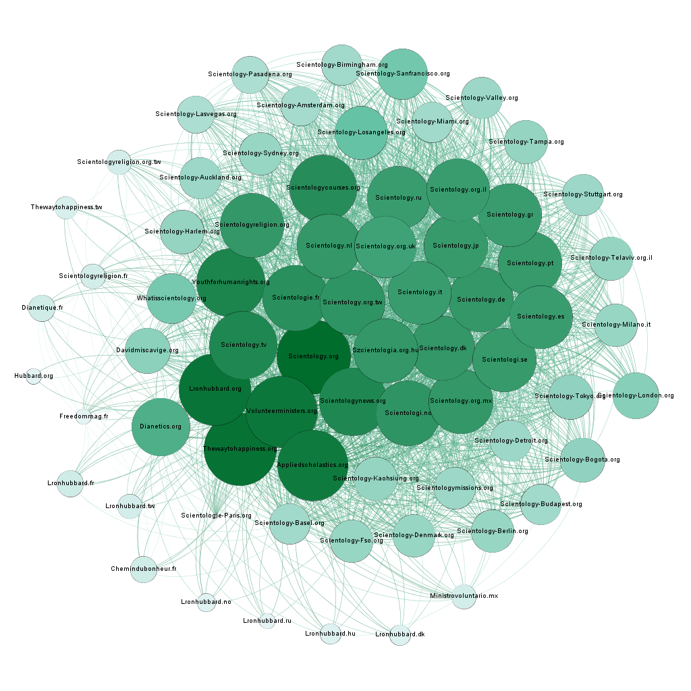

# Graph visualization

## Academic context
I created these graphs for **Franck Ghitalla**'s network science course. In these graphs, each edge is a hyperlink and a node is a web entity. To create these graphs, I just needed to realize few simple crawls.

Thanks to this kind of graph, we can visualize and analyze strategies for occupation of web territory. We can also consider social organizations thanks to the web content production.

I studied the strategy of occupation of several groups : far right, Scientology and Jehovah's Witnesses. I choosed to show only the graphe about Scientology because I consider it as the most clean and atypical.

## Graph on Scientology's strategy of web occupation
Thanks to the graph below, we see an occupation of Web territory very well thought by Church of Scientology. To create this graph, I just needed to crawl from scientology.org (with a fixed maximum depth). No data cleaning has been done.

[Web Version of the graph](Scientologie/index.html)

### *Caption*: 

* Node : Web site/entity
* Edge : Hyperlink beteen two entities
* Color/Size : node degree

### Graph analysis: 

* The Scientology Web **looks like an intranet**: there is no outbound link pointing at *Mainstream Web* like *Youtube*, etc.
* The nodes have an **extremely high degree** : usually for this kind of website sample, the entity with the highest degree is Youtube and isn't pointed by 90% of the websites.
* There is a **very high density** which created this round shape.
* There are two poles: a religious one (scientology.org,...) and a cultural one (Dianetics.org,...)
* The further a website is from the center, the more local the entity is(Scientologi.se, Scientology-Detroit.org,...)
* There are just few french nodes and their degrees are extremely low.

### Conclusions:
Scientology deployed a very cleaver Web occupation. Firstly, we notice the existence of a cultural pole which could be a important entry point to the religious part of Scientology. The idea of not having outbound links in this cluster allows to keep the users in the Scientology Web. The big degrees grants a vey good ranking by Google algorithms. Finally, the local entities have low degrees because they present an interest for "believers" who have a daily use of these websites. They are like the end of the road in the Scientology Web. 

The low degree of french nodes is a strong argument to explain the small presence of Scientology in France (compared to other countries). Therefore, we notice that Scientology haven't succeed in deploying their strategy of Web occupation in France yet.

## Technologies
* Python (crawler)
* Gephi
* Hyphe
