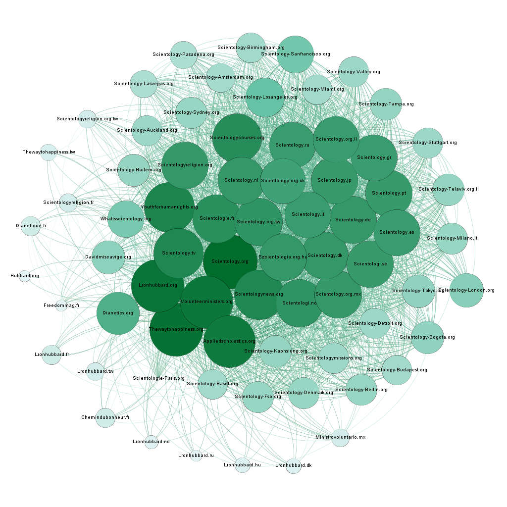

# Visualisation de graphes

## Contexte académique
Dans le cadre d'un cours de **Franck Ghitalla** sur la science des réseaux, j'étais amené à réaliser des graphes du lien (hyperlien) entre
des entités web. Pour réaliser ce type de graphe, il suffit de créer un crawler. 

Grâce à un tel graphe, on peut visualiser et interpréter une stratégie d'occupation du territoire numérique. On peut
également envisager les organisations sociales par leur production de contenus web.

Nous avons étudié la stratégie d'occupation de plusieurs groupes : fachosphère, Scientologie et témoins de Jéhovah. Ici, e choisis de montrer seulement le graphe relatif à la Scientologie car je considère qu'il est celui le plus propre et le plus atypique.

## Graphe sur la stratégie d'occupation du territoire numérique de la Scientologie
Sur le graphe ci-dessous, on peut visualiser une occupation du territoire numérique très bien conçue par la Scientologie. Pour obtenir ce graphe, il a simplement fallu crawl (avec une profondeur donnée) à partir de scientology.org. Aucun traitement supplémentaire ou nettoyage des résultats a été nécessaire.

[Version Web du graphe](Scientologie/index.html)

### *Légende*: 

* Noeud : site/entité web.
* Lien : Hyperlien entre deux entités
* Couleur/Taille : Degré du noeud

### Analyse du graphe: 
* Le Web de la Scientologie **ressemble à un sorte intranet**, il n'y a aucun lien qui se dirige vers le Web *classique* tel que *Youtube*, etc.
* Les noeuds ont un **degré extrêmement grand** : généralement sur un échantillon de cette taille, l'entité avec le plus grand degré est Youtube. 
Ici, les entités au plus grand degré sont pointées par près de 90% des sites.
* Il y a une **densité très grande** (créant cette forme ronde)
* Il y a deux pôles: un religieux (scientology.org,...) et un culturel (Dianetics.org,...)
* Plus on s'éloigne du centre, plus les sites correspondent à des entités locales (Scientologi.se, Scientology-Detroit.org,...)
* Il y a très peu de noeuds français et ces noeuds ont un degré extrêmement faible

### Conclusions:
La Scientologie a très bien réfléchi son occupation du Web. Premièrement, l'existence du pôle culturel moins connoté religion représente une porte d'entrée vers la Scientologie. L'idée d'avoir des pages sans lien sortant de ce cluster Scientologie permet de conserver ses internautes. Les degrés très grands permettent un très bon référencement par l'algorithme de Google. Enfin, les déclinaisons locales ont des degrés très faibles car elles représentent des entités utiles pour des "croyants" confirmés et à l'utilisation plus quotidienne. Ces sites sont donc le bout du chemin pour un utilisateur. 

Le degré des noeuds français est un argument explicant la présence moindre de cette secte en France par rapport à d'autres pays. Ainsi, on constate que la stratégie d'occupation du territoire numérique n'a pas été encore appliqué sur le Web français.

## Technologies
* Python (pour le crawler)
* Gephi
* Hyphe
